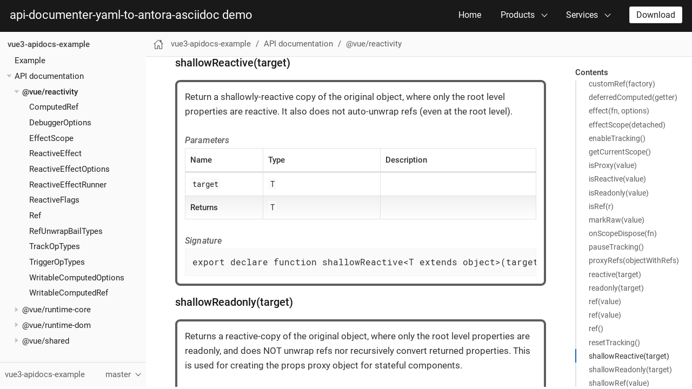

# api-documenter-yaml-to-antora-asciidoc

Finally, I found it. A documentation pipeline to generate API documentation for my TypeScript projects that works for me.

I looks like this:

It use it in my projects:

For more information, check out the [project documention page](https://docs.dt.in.th/api-documenter-yaml-to-antora-asciidoc/index.html).

